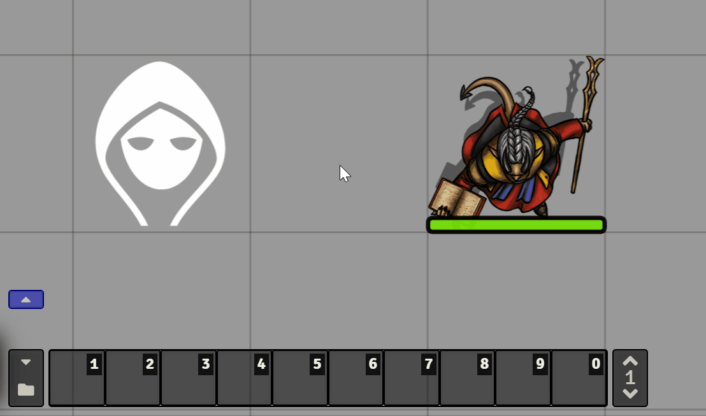
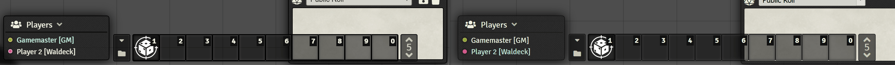

# Token Hotbar


[](https://forge-vtt.com/bazaar#package=foundry-tokenhotbar-js)


[](https://www.foundryvtt-hub.com/package/foundry-tokenhotbar-js/)


[](https://weblate.foundryvtt-hub.com/engage/token-hotbar/)

This module provides a unique hotbar for every token. If the token is linked to an actor (for player characters), then all tokens of that actor will have the same hotbar.

It's slimmed down to make maintenance easier and hopefully the code is easier to understand for anyone who has ever written a macro in Foundry.

## Known issue/Limitation

## Installation

It's always easiest to install modules from the in game add-on browser.

To install this module manually:
1.  Inside the Foundry "Configuration and Setup" screen, click "Add-on Modules"
2.  Click "Install Module"
3.  In the "Manifest URL" field, paste the following url:
`https://raw.githubusercontent.com/janssen-io/foundry-tokenhotbar-js/master/src/module.json`
4.  Click 'Install' and wait for installation to complete
5.  Don't forget to enable the module in game using the "Manage Module" button

## Features

### Dynamically change the hotbar

All pages of the hotbar will change depending on the token you have selected.

<p align="center">

</p>

### Use an additional hotbar

Since version [1.3.1](https://github.com/janssen-io/foundry-tokenhotbar-js/releases/v1.3.1), this module supports using [Norc's Custom Hotbar](https://github.com/Norc/foundry-custom-hotbar) to place the Token Hotbar on. You can enable this in the settings.

<p align="center">

</p>

### Enable the Token Hotbar per client

Since version [1.3.1](https://github.com/janssen-io/foundry-tokenhotbar-js/releases/v1.3.1), this module supports enabling and disabling the Token Hotbar per client. For example, the GM can use this to have different hotbars for different tokens. But the players might want a single hotbar as they usually control a single token anyway.

### Shared Token Hotbar

Hotbar's can be shared manually via the provided macro. A GM can run this macro and select for which
tokens and with which player they want to share the hotbar. You can find this macro in the compendium 'Token Hotbar'.

<p align="center">

</p>

## Settings

* **Always link to actor:** link the hotbar to the actor, even if the token itself is not linked.
* **Use Norc's Custom Hotbar:** Place the Token Hotbar on [Norc's Custom Hotbar](https://github.com/Norc/foundry-custom-hotbar), instead of the original hotbar.
* **Debug Mode:** Show detailed messages in the console (F12).

## API

A little api to use in macro or external module ecc.

The api is reachable from the variable `game.modules.get('token-hotbar').api` or from the socket libary `socketLib` on the variable `game.modules.get('token-hotbar').socket` if present and active.

## Available Languages
* 🇨🇳 中文（简体）
* 🇩🇪 Deutsch
* 🇬🇧 English
* 🇪🇸 Español
* 🇫🇷 Français
* 🇯🇵 日本語
* 🇰🇷 한국어
* 🇳🇱 Nederlands
* 🇵🇱 Polski
* 🇧🇷 Português (Brazil)
* 🇷🇴 Română

# Build

## Install all packages

```bash
npm install
```
## npm build scripts

### build

will build the code and copy all necessary assets into the dist folder and make a symlink to install the result into your foundry data; create a
`foundryconfig.json` file with your Foundry Data path.

```json
{
  "dataPath": "~/.local/share/FoundryVTT/"
}
```

`build` will build and set up a symlink between `dist` and your `dataPath`.

```bash
npm run-script build
```

### NOTE:

You don't need to build the `foundryconfig.json` file you can just copy the content of the `dist` folder on the module folder under `modules` of Foundry

### build:watch

`build:watch` will build and watch for changes, rebuilding automatically.

```bash
npm run-script build:watch
```

### clean

`clean` will remove all contents in the dist folder (but keeps the link from build:install).

```bash
npm run-script clean
```

### prettier-format

`prettier-format` launch the prettier plugin based on the configuration [here](./.prettierrc)

```bash
npm run-script prettier-format
```

### package

`package` generates a zip file containing the contents of the dist folder generated previously with the `build` command. Useful for those who want to manually load the module or want to create their own release

```bash
npm run-script package
```

## [Changelog](./CHANGELOG.md)

## Issues

Any issues, bugs, or feature requests are always welcome to be reported directly to the [Issue Tracker](https://github.com/janssen-io/foundryvtt-arms-reach/issues ), or using the [Bug Reporter Module](https://foundryvtt.com/packages/bug-reporter/).

## License

This package is under an [MIT license](LICENSE) and the [Foundry Virtual Tabletop Limited License Agreement for module development](https://foundryvtt.com/article/license/).

## Credit

Thanks to anyone who helps me with this code! I appreciate the user community's feedback on this project!

A very big thanks to [janssen](https://github.com/janssen-io), for update this module for 0.8.9 and make it work for 9 [foundry-tokenhotbar-js](https://github.com/janssen-io/foundry-tokenhotbar-js).

## Acknowledgements

Feel free to test out the latest beta using the following manifest link:
```
https://fvtt.janssen.io/tokenhotbar/beta/module.json
```
If you wish to help out with development, then clone the repo and start digging in!
Unit tests are much appreciated. :)

The original Token Hotbar had some issues which were hard to resolve ([#38](https://github.com/League-of-Foundry-Developers/foundry-token-hotbar/issues/46), [#46](https://github.com/League-of-Foundry-Developers/foundry-token-hotbar/issues/46) and [#50](https://github.com/League-of-Foundry-Developers/foundry-token-hotbar/issues/50)). So I created this new version that has a more stable, but unfortunately also more limited functionality.

On top of that, the code is kept more straight forward so it's easier for other developers to see what's going on (and perhaps help with maintenance later on).
